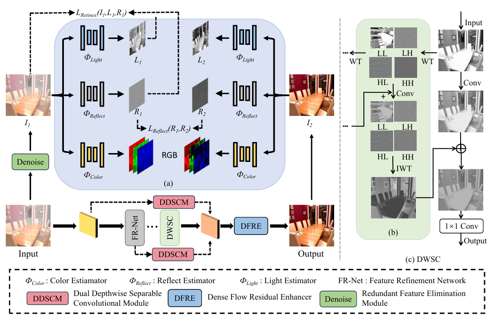

# UR2P-Dehaze: Learning a Simple Image Dehaze Enhancer via Unpaired Rich Physical Prior

Abstract
===========================
Image dehazing techniques aim to enhance contrast and restore details, which are essential for preserving visual information and improving image processing accuracy. Existing methods rely on a single manual prior, which cannot effectively reveal image details. To overcome this limitation, we propose an unpaired image dehazing network, called the Simple Image Dehaze Enhancer via Unpaired Rich Physical Prior (UR2P-Dehaze). First, to accurately estimate the illumination, reflectance, and color information of the hazy image, we design a shared prior estimator (SPE) that is iteratively trained to ensure the consistency of illumination and reflectance, generating clear, high-quality images. Additionally, a self-monitoring mechanism is introduced to eliminate undesirable features, providing reliable priors for image reconstruction. Next, we propose Dynamic Wavelet Separable Convolution (DWSC), which effectively integrates key features across both low and high frequencies, significantly enhancing the preservation of image details and ensuring global consistency. Finally, to effectively restore the color information of the image, we propose an Adaptive Color Corrector(ACC) that addresses the problem of unclear colors. The PSNR, SSIM, LPIPS, FID and CIEDE2000 metrics on the benchmark dataset show that our method achieves state-of-the-art performance. It also contributes to the performance improvement of downstream tasks.




Preparation
===========================
### Clone the repo

```sh
git clone https://github.com/Fan-pixel/UR2P-Dehaze.git
cd UR2P-Dehaze
```

## Install
Python 3.7 + Pytorch, please refer 'environment.yml' for detiled requirments.
You can create a new conda environment:
```
conda env create -f environment.yml
```
Datasets
===========================
We used [SOTS-indoor](https://sites.google.com/view/reside-dehaze-datasets/reside-v0), [SOTS-outdoor](https://sites.google.com/view/reside-dehaze-datasets/reside-v0),[HSTS](https://sites.google.com/view/reside-dehaze-datasets/reside-v0)  and [I-HAZE](https://data.vision.ee.ethz.ch/cvl/ntire18//i-haze/) for testing.  

For training, we used [ITS](https://sites.google.com/view/reside-dehaze-datasets/reside-standard) dataset, you can follow the operations above to generate the training file lists.

## Training and Test
Training
You can modify the training settings for each experiment in the 'configs.yml'. Then run the following script to train the model：
```
CUDA_VISIBLE_DEVICES=xxxx python train.py --model （Model class） --checkpoints （Training sample address）
```
Testing
Run the following script to test the trained model：
```
CUDA_VISIBLE_DEVICES=XXX python test.py --model （Model class） --checkpoints （Test sample address）
```

Such as SOTS-indoor，SOTS-outdoor, you can download the pretrained models on [Training weight](https://pan.baidu.com/s/1egiZQp5VgpVPQmUT9Y9wIg)(c1hh).

## Qualitative Results
### Comparison Experiment


### Dehazing results on SOTS-Indoor


### Dehazing results on SOTS-Outdoor


### Dehazing results on HSTS


### Dehazing results on I-HAZE


## Contact
If you have any questions, please contact the email Fansb@stu.cqut.edu.cn
