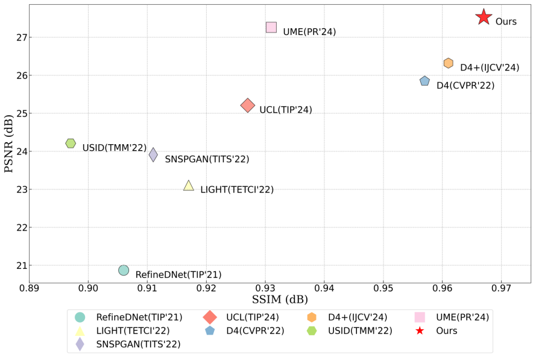
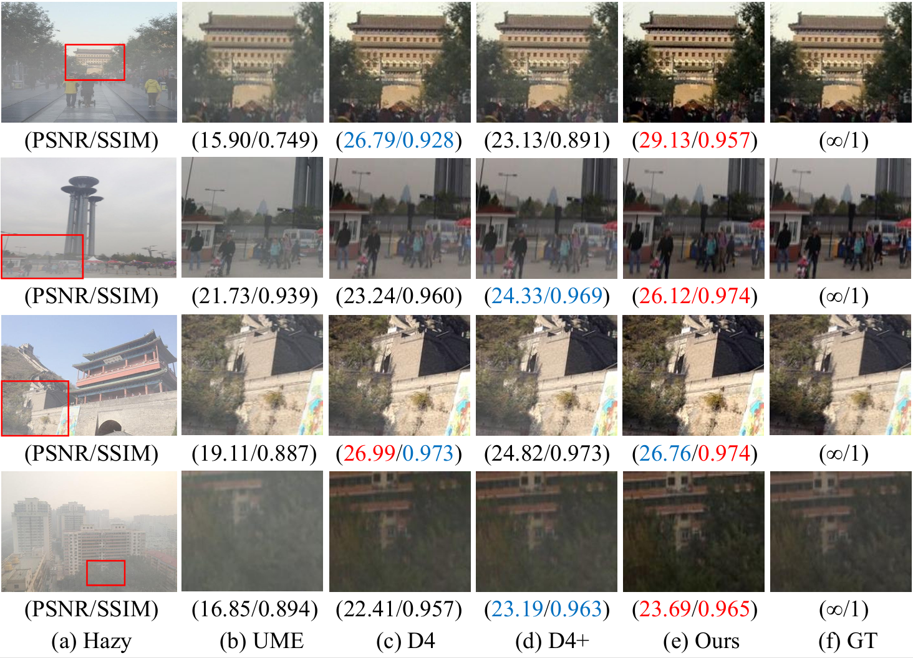

# UR2P-Dehaze: Learning a Simple Image Dehaze Enhancer via Unpaired Rich Physical Prior

Abstract
===========================
Image dehazing techniques aim to enhance contrast and restore details, which are essential for preserving visual information and improving image processing accuracy. Existing methods rely on a single manual prior, which cannot effectively reveal image details. To overcome this limitation, we propose an unpaired image dehazing network, called the Simple Image Dehaze Enhancer via Unpaired Rich Physical Prior (UR2P-Dehaze). First, to accurately estimate the illumination, reflectance, and color information of the hazy image, we design a shared prior estimator (SPE) that is iteratively trained to ensure the consistency of illumination and reflectance, generating clear, high-quality images. Additionally, a self-monitoring mechanism is introduced to eliminate undesirable features, providing reliable priors for image reconstruction. Next, we propose Dynamic Wavelet Separable Convolution (DWSC), which effectively integrates key features across both low and high frequencies, significantly enhancing the preservation of image details and ensuring global consistency. Finally, to effectively restore the color information of the image, we propose an Adaptive Color Corrector that addresses the problem of unclear colors. The PSNR, SSIM, LPIPS, FID and CIEDE2000 metrics on the benchmark dataset show that our method achieves state-of-the-art performance. It also contributes to the performance improvement of downstream tasks.

Preparation
===========================
## Install
Python 3.7 + Pytorch, please refer 'environment.yml' for detiled requirments.
You can create a new conda environment:
```
conda env create -f environment.yml
```

## Main Results
### Comparison Experiment


### Dehazing results on SOTS-Outdoor



